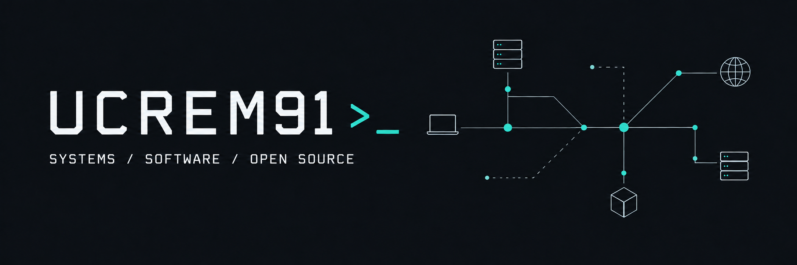

  

# Hi, I'm Ucrem

**Systems · DevOps · Networking · Security · Software Development**

I enjoy understanding how technology works across the stack: from operating systems and networks to applications and distributed systems. I build software, manage infrastructure, and explore how security and privacy shape the systems we use.

This is my personal space for open-source projects, experiments, and contributions. My company work lives in a separate account.

## Areas of focus

- **Systems & DevOps:** virtualization, containers, infrastructure automation, and reproducible environments.
- **Networking & cybersecurity:** understanding how systems communicate, where trust boundaries sit, and how to reduce exposure.
- **Software development:** web applications, desktop tools, and practical utilities.
- **Privacy & decentralized technology:** cryptography, blockchain, and the trade-offs of distributed systems.

## Stack

| Area | Technologies |
| :--- | :--- |
| Operating systems | Linux, macOS, Windows |
| Virtualization | Hyper-V, Proxmox, VMware |
| Containers & cloud | Docker, Kubernetes, AWS |
| Databases | MongoDB, PostgreSQL, MySQL |
| Web | JavaScript, TypeScript, React |
| Desktop & tooling | Rust, Tauri, Python |

## Currently exploring

I'm developing an experimental privacy-first cryptocurrency project, exploring privacy, decentralization, and the engineering trade-offs behind them. It is a work in progress: privacy is a design goal, not a claim of proven anonymity or security.

## Open source

I want to publish useful tools, share what I learn, and contribute to projects I use. I'm interested in collaboration around systems, developer tooling, infrastructure, and privacy-focused software.

For project-specific ideas, questions, or contributions, start with the relevant repository's contributing guidelines and issue tracker.
